<div align="center">
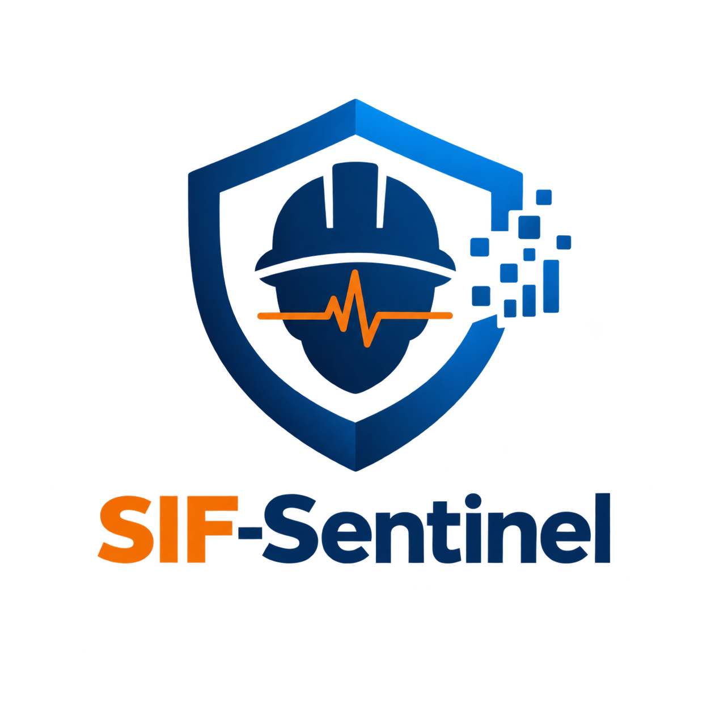
# SIF-Sentinel

### *Don't predict the accident. Detect the precursor.*
 
An explainable AI/NLP engine that reads free-text safety reports and detects **Serious Injury & Fatality (SIF) precursors** before they become accidents.
 


 
**Team LiftOff** · Team ID **156159** · Category: Software · Theme: Smart Automation
 <div align="center">

Welcome to **SIF Sentinel**, an explainable AI/NLP safety intelligence platform designed to analyze free-text safety reports and identify **Serious Injury & Fatality (SIF) precursors** before they develop into serious incidents.

SIF-Sentinel transforms unstructured safety observations into structured safety intelligence by analyzing **SIF potential, Life-Saving Rules, safety hazards, critical barrier failures, and recurring precursor patterns**. The platform is designed to help HSE teams move beyond simply asking *what happened* and instead investigate **what could have happened, which critical barrier was missing or failed, and where similar precursor conditions are recurring**.

</div>
</div>
 
## Table of Contents
1. [Overview](#1-overview)
2. [Why Severity Alone Is Not Enough](#2-why-severity-alone-is-not-enough)
3. [Key Features](#3-key-features)
4. [Product Screens](#4-product-screens)
5. [System Architecture](#5-system-architecture)
6. [AI/NLP Engine](#6-ainlp-engine)
7. [Data Model](#7-data-model)
8. [Life-Saving Rules Taxonomy](#8-life-saving-rules-taxonomy)
9. [Tech Stack](#9-tech-stack)
10. [Repository Structure](#10-repository-structure)
11. [Getting Started](#11-getting-started)
12. [API Reference](#12-api-reference)
13. [Configuration](#13-configuration)
14. [Evaluation Plan](#14-evaluation-plan)
15. [Security, Privacy & Responsible AI](#15-security-privacy--responsible-ai)
16. [Roadmap](#16-roadmap)
17. [Limitations](#17-limitations)
18. [References](#18-references)
19. [Team](#19-team)
20. [License](#20-license)
---
 
## 1. Overview
 
Oil and gas operators collect thousands of **Unsafe Act / Unsafe Condition (UA/UC)**, **near-miss** and **incident** reports. Most are free text written under time pressure. Reviewing them by hand is slow and periodic, so a report that describes a *fatality-in-waiting* can sit in a queue for weeks.
 
**SIF-Sentinel** turns that unstructured text into structured safety intelligence:
 
| Input | Output |
|---|---|
| Free-text safety report + metadata (asset, shift, activity) | SIF potential class and confidence |
| | Life-Saving Rule(s) involved |
| | Hazard, energy source and exposure |
| | Failed or missing **barrier** (the control that should have stopped it) |
| | Recurring **precursor pattern** across rigs |
| | Evidence span (the exact words that triggered the flag) |
| | Priority for HSE review |
 
The core idea is a chain, not a single label:
 
```
Exposure  →  SIF potential  →  Critical barrier  →  Life-Saving Rule  →  Recurring pattern  →  Intervention priority
```
 
---
 
## 2. Why Severity Alone Is Not Enough
 
A near miss with **no injury** can still be one small step from a fatality. Ranking reports by *actual* consequence hides exactly the ones that matter most. SIF-Sentinel ranks by *potential* consequence and by *which barrier failed*.
 
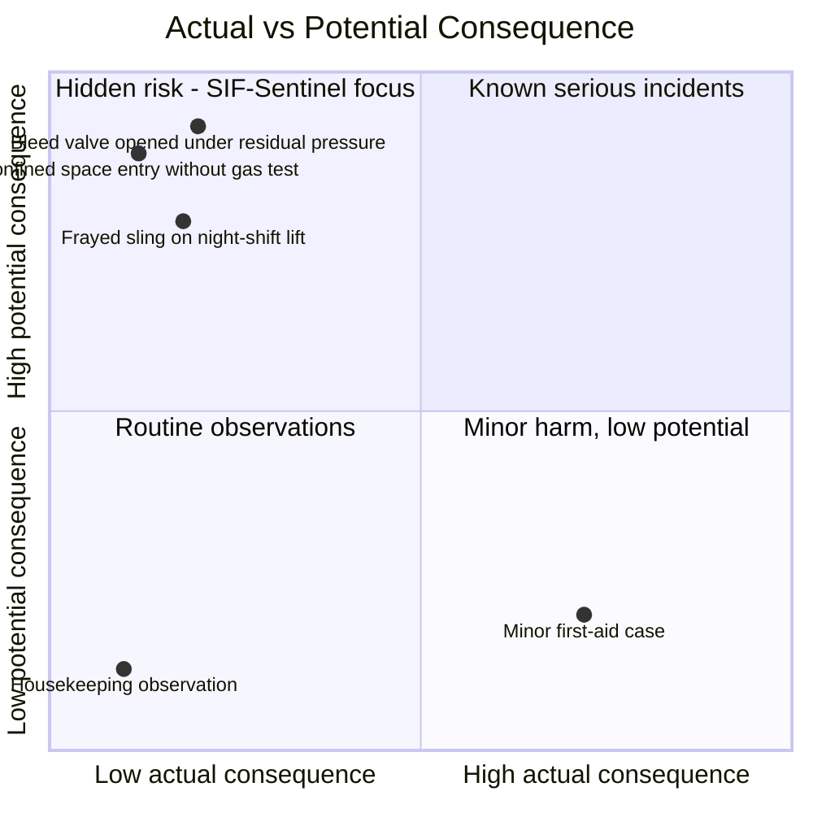
 
> The points above are illustrative examples of the idea, not measured data.
 
---
 
## 3. Key Features
 
- **Potential-based classification.** Four classes: *Non-SIF, SIF Potential, High SIF, Critical SIF*.
- **Multi-label Life-Saving Rule mapping.** One report can breach several rules at once (for example Energy Isolation + Line of Fire).
- **Barrier failure detection.** Links hazard → expected barrier → observed status (*missing, unverified, bypassed*). This is the core differentiator.
- **Recurring precursor discovery.** Semantic clustering finds the same hidden condition across sites and rigs.
- **Explainable AI.** Every flag shows confidence, top signal drivers and the evidence span. HSE can confirm or override.
- **Human-in-the-loop.** Nothing is "Verified" until an HSE Officer signs off; overrides feed back as new training labels.
- **Hard safety net.** Deterministic rules force high-risk phrases (bypassed interlock, muted H2S alarm, trapped pressure) to at least *High SIF*, regardless of model score.
- **Command-room dashboard.** Home, Reports, SIF Analysis, Life-Saving Rules, Barriers, Patterns, Sites and a Review Queue.
---
 
## 4. Product Screens
 
> Prototype UI built with the [SIF-Sentinel Design System](docs/DESIGN.md). Demo data only.
 
### Home: Safety Intelligence Dashboard

### Safety Reports & Observations

### SIF Analysis

### Life-Saving Rules

### Barrier Analysis

### Precursor Patterns

Demo distribution shown on the Home dashboard:
 
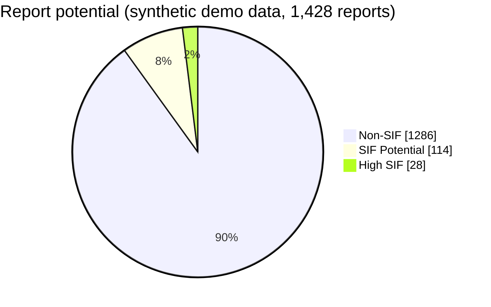
 
---
 
## 5. System Architecture
 
### 5.1 High-level architecture
 
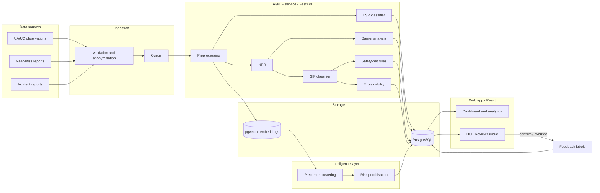
 
### 5.2 Report lifecycle (sequence)
 
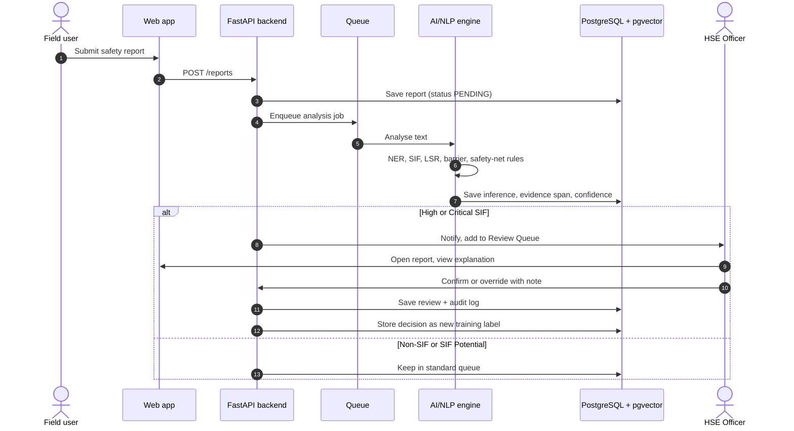
 
### 5.3 Report status state machine
 
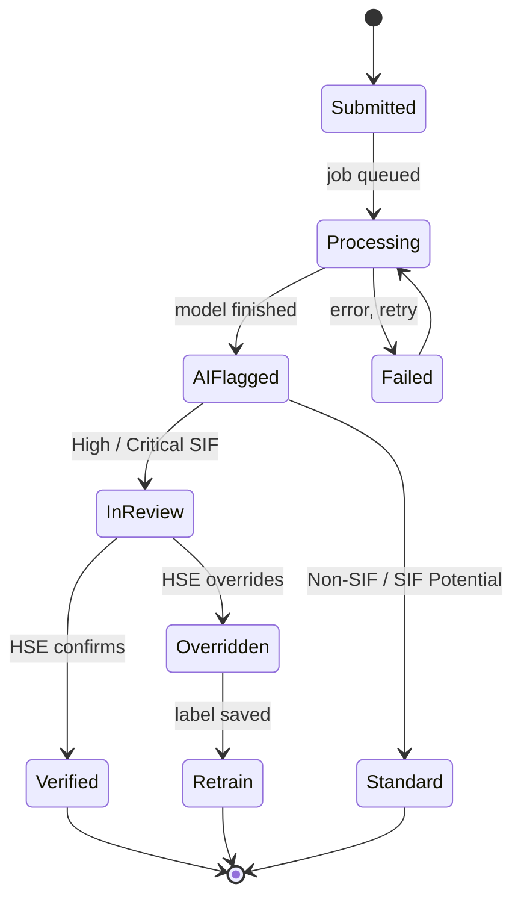
 
---
 
## 6. AI/NLP Engine
 
### 6.1 Processing pipeline
 
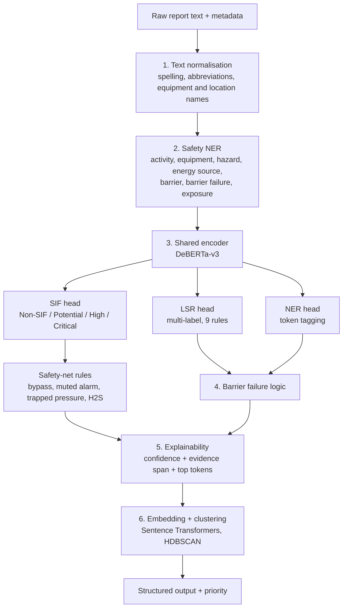
 
### 6.2 Barrier failure logic
 
The system reasons in three steps: *what hazard is present*, *which barrier should stop it*, *what does the text say about that barrier*.
 
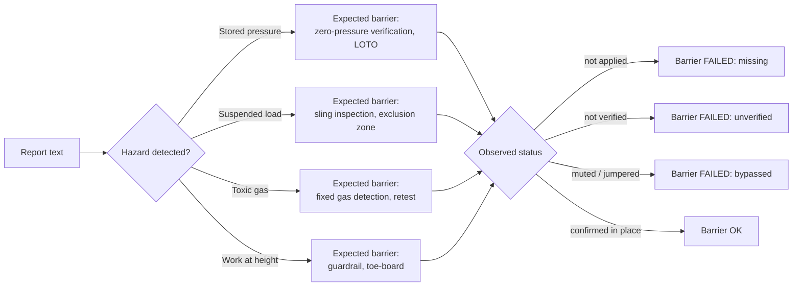
 
**Worked example (illustrative)**
 
| Field | Value |
|---|---|
| Report | *"Pump stopped, but LOTO was not applied before opening the connected line."* |
| SIF potential | High |
| Life-Saving Rule | Energy Isolation |
| Hazard | Stored / residual energy |
| Barrier | LOTO, **missing** |
| Evidence span | "LOTO was not applied" |
| Priority | Immediate HSE review |
 
### 6.3 Precursor pattern discovery and escalation
 
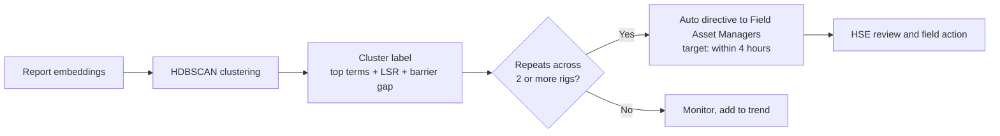
 
### 6.4 Modelling decisions
 
| Topic | Decision | Reason |
|---|---|---|
| Encoder | DeBERTa-v3 shared encoder with three task heads | One model learns SIF, rules and entities together; cheaper than three models |
| Labels are scarce | Expert gold set + Snorkel-style weak supervision (keyword, rule, metadata and pattern labelling functions) | SIF is rare; expert time is limited |
| Class imbalance | Class weights, focal loss, stratified sampling, hard-negative mining, threshold tuning | Most reports are Non-SIF |
| Metric | **F2** and PR-AUC, recall on High/Critical | A missed precursor costs far more than a false alarm |
| Explainability | Confidence, evidence span, top-token attributions (SHAP) | HSE must be able to verify or override |
| Baselines | TF-IDF + Logistic Regression, TF-IDF + SVM, BERT/RoBERTa | Proves the upgrade is worth it |
| Safety net | Deterministic rules force a minimum *High SIF* | Guards against a model miss on the worst phrases |
| Feedback | HSE overrides become new labels | Continuous improvement |
 
---
 
## 7. Data Model
 
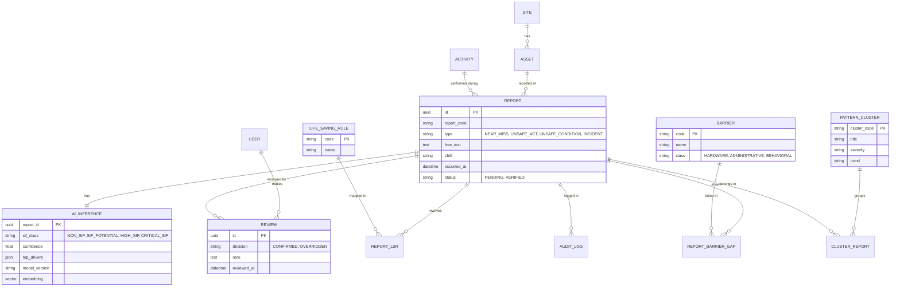
 
> **Rule:** every dashboard number is computed from these tables with SQL. No KPI is hard-coded in the UI.
 
---
 
## 8. Life-Saving Rules Taxonomy
 
The nine rules follow the IOGP Life-Saving Rules. Codes below are the canonical IDs stored in `data/lsr.json` and used by every page and API.
 
| Code | Rule | Typical exposure |
|---|---|---|
| LSR-01 | Bypassing Safety Controls | Interlocks, trips, muted alarms |
| LSR-02 | Confined Space | Tank entry, atmosphere retest |
| LSR-03 | Driving | Fleet, access roads |
| LSR-04 | Energy Isolation | LOTO, stored pressure, bleed-off |
| LSR-05 | Hot Work | Welding, ignition sources |
| LSR-06 | Line of Fire | High-pressure lines, pipe racks |
| LSR-07 | Safe Mechanical Lifting | Cranes, slings, rigging |
| LSR-08 | Work Authorisation | Permit to work, handover |
| LSR-09 | Work at Height | Derrick, scaffolds, platforms |
 
---
 
## 9. Tech Stack
 
| Layer | Technology |
|---|---|
| Frontend | React, TypeScript, Tailwind CSS, Recharts, Leaflet |
| Backend | Python, FastAPI, REST APIs |
| AI / ML | PyTorch, Hugging Face Transformers (DeBERTa-v3), spaCy, scikit-learn, Sentence Transformers, HDBSCAN / BERTopic |
| Weak supervision | Snorkel-style labelling functions |
| Data | PostgreSQL + pgvector |
| DevOps | Docker, Docker Compose, GitHub Actions (CI/CD) |
| Design | [SIF-Sentinel Design System](docs/DESIGN.md): Hanken Grotesk, Public Sans, JetBrains Mono |
 
---
 
## 10. Repository Structure
 
```
SIF-Sentinel/
├─ frontend/                 # React + TypeScript app
│  ├─ src/pages/             # Home, Reports, SifAnalysis, LifeSavingRules,
│  │                         # Barriers, Patterns, Sites, Review
│  ├─ src/components/        # SeverityBadge, AIBadge, KpiCard, DataTable ...
│  └─ src/styles/tokens.css  # design tokens from DESIGN.md
├─ backend/
│  ├─ app/
│  │  ├─ api/                # routers: reports, review, analytics, rules, barriers, patterns
│  │  ├─ core/               # config, security, logging
│  │  ├─ db/                 # models, migrations, session
│  │  ├─ nlp/                # preprocess, ner, sif, lsr, barrier, explain, safety_rules
│  │  └─ workers/            # queue consumers, clustering job
│  └─ tests/
├─ ml/
│  ├─ notebooks/             # Colab / Jupyter experiments
│  ├─ training/              # train_baseline.py, train_deberta.py, evaluate.py
│  └─ models/                # saved weights (gitignored)
├─ data/
│  ├─ lsr.json               # canonical Life-Saving Rules
│  ├─ barriers.json
│  └─ synthetic_reports.jsonl
├─ docs/
│  ├─ DESIGN.md
│  └─ images/
├─ docker-compose.yml
├─ .env.example
└─ README.md
```
 
---
 
## 11. Getting Started
 
### Prerequisites
- Node.js 20+ and npm or pnpm
- Python 3.11+
- Docker and Docker Compose
- (Optional) A GPU or Google Colab for fine-tuning DeBERTa-v3
### Quick start with Docker
```bash
git clone https://github.com/Siddiquiashrafhussain/SIF-Sentinel.git
cd SIF-Sentinel
cp .env.example .env
docker compose up --build
```
 
| Service | URL |
|---|---|
| Web app | http://localhost:3000 |
| API + Swagger docs | http://localhost:8000/docs |
| PostgreSQL | localhost:5432 |
 
### Run without Docker
 
**Backend**
```bash
cd backend
python -m venv .venv && source .venv/bin/activate    # Windows: .venv\Scripts\activate
pip install -r requirements.txt
alembic upgrade head
python -m app.db.seed          # loads synthetic demo data
uvicorn app.main:app --reload --port 8000
```
 
**Frontend**
```bash
cd frontend
npm install
npm run dev
```
 
**Train models (optional)**
```bash
cd ml
pip install -r requirements.txt
python training/train_baseline.py      # TF-IDF + Logistic Regression
python training/train_deberta.py       # fine-tune, best on a GPU / Colab
python training/evaluate.py            # writes metrics + confusion matrix
```
Copy the trained model into `ml/models/`; the FastAPI service loads it at startup.
 
> Commands follow the planned layout in section 10. Adjust paths to match the current state of the repository.
 
---
 
## 12. API Reference
 
| Method | Endpoint | Description |
|---|---|---|
| `POST` | `/auth/login` | Sign in, returns session cookie |
| `GET` | `/auth/me` | Current user and role |
| `POST` | `/reports` | Submit a report (queues AI analysis) |
| `GET` | `/reports` | List with filters: `type`, `sif`, `asset`, `lsr`, `status`, `q`, `page` |
| `GET` | `/reports/{id}` | Report with AI explanation |
| `GET` | `/review/queue` | Reports awaiting HSE sign-off |
| `POST` | `/review/{report_id}` | Confirm or override with a note |
| `GET` | `/analytics/overview` | Home dashboard KPIs |
| `GET` | `/analytics/sif-trend` | Rolling SIF trend |
| `GET` | `/rules` | Life-Saving Rule exposure summary |
| `GET` | `/barriers/summary` | Barrier gaps and integrity by tier |
| `GET` | `/patterns` | Precursor clusters |
| `POST` | `/patterns/recompute` | Re-run clustering |
| `POST` | `/nlp/predict` | Text in, SIF / LSR / barrier / evidence out |
| `GET` | `/health` | Service health |
 
**Example: `POST /nlp/predict`**
```json
{
  "text": "Pump stopped, but LOTO was not applied before opening the connected line.",
  "asset": "Rig-4",
  "shift": "Night"
}
```
```json
{
  "sif_class": "HIGH_SIF",
  "confidence": 0.93,
  "life_saving_rules": ["LSR-04"],
  "hazard": "stored_energy",
  "barrier": { "code": "LOTO", "status": "missing" },
  "evidence_span": "LOTO was not applied",
  "priority": "IMMEDIATE_HSE_REVIEW",
  "model_version": "example"
}
```
> The response above is an illustrative format, not a measured model output.
 
---
 
## 13. Configuration
 
Copy `.env.example` to `.env`.
 
| Variable | Purpose | Example |
|---|---|---|
| `DATABASE_URL` | PostgreSQL connection | `postgresql://user:pass@db:5432/sif` |
| `SECRET_KEY` | Session / JWT signing | *(generate a long random value)* |
| `CORS_ORIGINS` | Allowed web origins | `http://localhost:3000` |
| `MODEL_PATH` | Trained model folder | `ml/models/deberta-v3` |
| `CLUSTER_SENSITIVITY` | Clustering strictness | `0.85` |
| `ESCALATION_MIN_RIGS` | Rigs needed to auto-escalate | `2` |
| `DEMO_MODE` | Shows the demo-data banner | `true` |
 
---
 
## 14. Evaluation Plan
 
Results are **not published yet**. The plan below is how the system will be judged.
 
| Task | Metric | Design target |
|---|---|---|
| SIF potential | Recall (High/Critical), F2, PR-AUC | Recall ≥ 0.90 on High/Critical |
| Life-Saving Rules | Micro / macro F1 | Report on a hand-labelled test set |
| Entities and barriers | Entity-level F1, precision on barrier status | Report on 50+ hand-checked reports |
| Clustering | Cluster purity (expert check), silhouette | Expert-reviewed |
| Safety net | Rule coverage | 100% of listed phrases forced to ≥ High SIF |
| Human agreement | HSE agreement rate | Track over time |
 
**Honest testing rules**
- Train on synthetic data, then test on a **separate, hand-written** set.
- Report a confusion matrix, not just one accuracy number.
- Never claim performance on real OIL data until it has been tested on real, approved data.
---
 
## 15. Security, Privacy & Responsible AI
 
- **Human final say.** AI flags; a certified HSE Officer verifies. The UI shows *Verified by HSE Officer* only after sign-off.
- **Explainable by default.** Every flag shows confidence, drivers and evidence.
- **Access control.** Role-based access (HSE Officer, Field Supervisor, Admin); only HSE Officers can review.
- **Data protection.** Anonymisation before analysis, encryption in transit and at rest, no personal data in logs.
- **Auditability.** Every review and override writes an audit-log row.
- **Web security.** Validated inputs, parameterised queries (ORM only), rate-limited login, strict CORS, HTTPS in production.
- **Drift monitoring.** Watch input and score distributions; retrain periodically.
- **Transparency.** The demo-data banner stays on until real, approved data is used.
---
 
## 16. Roadmap
 
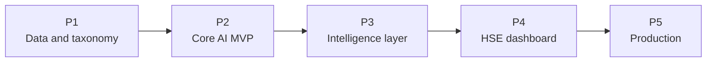
 
| Phase | Scope | Status |
|---|---|---|
| **P1** Data and taxonomy | Ingestion, anonymisation, expert gold set, IOGP rule mapping | In progress |
| **P2** Core AI MVP | DeBERTa-v3 multi-task model (SIF, LSR, NER) + baselines | Planned |
| **P3** Intelligence layer | Barrier failure logic, pgvector similarity, BERTopic / HDBSCAN | Planned |
| **P4** HSE dashboard | Risk maps, activity ranking, trends, evidence-span view | UI prototype done, API wiring planned |
| **P5** Production | RBAC, encryption, feedback loop, CI/CD, drift monitoring | Planned |
 
- [x] Design system and UI prototype screens
- [x] Problem definition and solution design
- [ ] Synthetic dataset generator with ground-truth labels
- [ ] Baseline model (TF-IDF + Logistic Regression)
- [ ] Fine-tuned DeBERTa-v3 multi-task model
- [ ] Backend API and database
- [ ] Human review and feedback loop
- [ ] Docker Compose deployment and CI
---
 
## 17. Limitations
 
- Trained and demonstrated on **synthetic data**; behaviour on real OIL reports is unknown until tested.
- Free-text quality varies (abbreviations, local terms, mixed languages); domain vocabulary work is ongoing.
- Rare-class learning depends on expert labels; weak supervision adds noise.
- The tool supports HSE judgement and does **not** replace it or any regulatory process.
---
 
## 18. References
 
1. Fang, W., Luo, H., Xu, S., Love, P. E. D., Lu, Z., Ye, C. (2020). *Automated text classification of near-misses from safety reports: An improved deep learning approach.* Advanced Engineering Informatics, 44.
2. He, P., Gao, J., Chen, W. (2021). *DeBERTaV3: Improving DeBERTa using ELECTRA-Style Pre-Training with Gradient-Disentangled Embedding Sharing.* arXiv:2111.09543.
3. Reimers, N., Gurevych, I. (2019). *Sentence-BERT: Sentence Embeddings using Siamese BERT-Networks.* EMNLP.
4. Campello, R., Moulavi, D., Sander, J. (2013). *Density-Based Clustering Based on Hierarchical Density Estimates (HDBSCAN).* PAKDD.
5. Ratner, A. et al. (2017). *Snorkel: Rapid Training Data Creation with Weak Supervision.* VLDB.
6. Lin, T.-Y. et al. (2017). *Focal Loss for Dense Object Detection.* ICCV.
7. Lundberg, S., Lee, S.-I. (2017). *A Unified Approach to Interpreting Model Predictions (SHAP).* NeurIPS.
8. IOGP. *Life-Saving Rules* (IOGP Report 459).
9. International Association of Oil & Gas Producers (IOGP). *Life-Saving Rules.* IOGP Report 459. London: IOGP. [Official report PDF / industry guidance document].
---

Works cited

1. Serious Injury and Fatality (SIF): Rethinking Measurement and,
   https://blog.intelex.com/measuring-safety-part-2-serious-injury-fatality-rethinkin
   g-measurement-and-prevention/
2. A Case Study in Assessing a Potential Severity Framework ... - OSTI,
   https://www.osti.gov/servlets/purl/2403431
3. AI/NLP Engine to Detect Serious Injury & Fatality (SIF) Precursors in,
   https://zaidsayyed.in/tools/sih-problem-statements/sih26165
4. Understanding SIF: Serious Injury and Fatality - NorthStandard,
   https://north-standard.com/insights-and-resources/resources/archive/articles/un
   derstanding-sif-serious-injury-and-fatality
5. Safety Classification and Learning (SCL) Model - EEI.org,
   https://www.eei.org/-/media/Project/EEI/Documents/Issues-and-Policy/Power-to
   Prevent-SIF/eeiSCLmodel.pdf
6. Serious Injury and Fatality Prevention Whitepaper - dekra uk,
   https://www.dekra-uk.co.uk/en/modern-blueprint-sif-prevention/
7. Serious Incident and Fatality Prevention Model (SIF),
   https://www.nsc.org/workplace/sif-prevention-model
8. Determining Serious Injury and Fatality Potential,
   https://dekraprod-media.e-spirit.cloud/d6df64f5-b4d9-468c-8ffa-874a167a15ab/

## 19. License

Released under the MIT License. See `LICENSE` for details.

<div align="center">

_Don't predict the accident. Detect the precursor._

</div>
