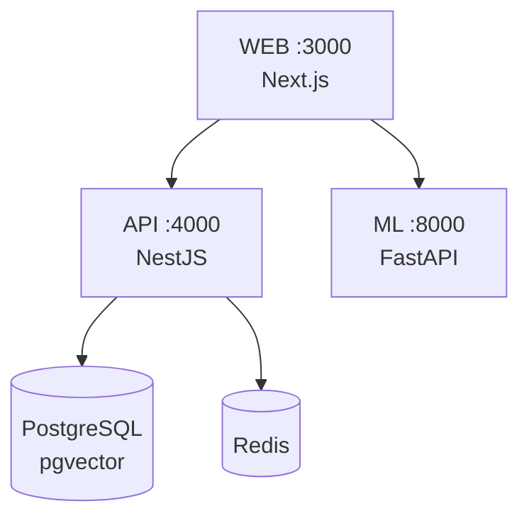

# Phase 0 Architecture

## SIF-Sentinel

```mermaid
graph TD
    WEB[WEB :3000<br/>Next.js] --> API[API :4000<br/>NestJS]
    WEB --> ML[ML :8000<br/>FastAPI]
    API --> DB[(PostgreSQL<br/>pgvector)]
    API --> CACHE[(Redis)]
```

All services are containerized for local development (infrastructure) or run via `pnpm` workspace tasks and python `.venv`.
