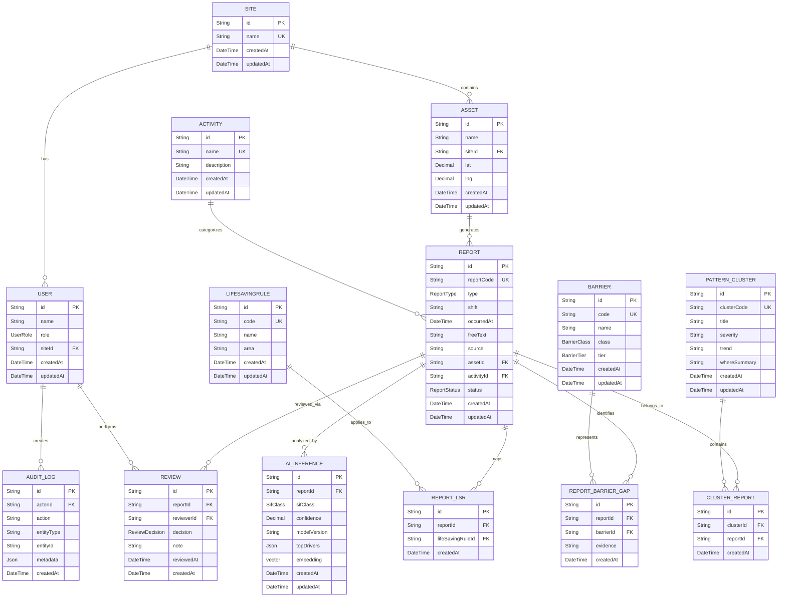

# SIF-Sentinel ER Diagram

```mermaid
erDiagram
    SITE {
        String id PK
        String name UK
        DateTime createdAt
        DateTime updatedAt
    }
    
    USER {
        String id PK
        String name
        UserRole role
        String siteId FK
        DateTime createdAt
        DateTime updatedAt
    }

    ASSET {
        String id PK
        String name
        String siteId FK
        Decimal lat
        Decimal lng
        DateTime createdAt
        DateTime updatedAt
    }

    ACTIVITY {
        String id PK
        String name UK
        String description
        DateTime createdAt
        DateTime updatedAt
    }

    REPORT {
        String id PK
        String reportCode UK
        ReportType type
        String shift
        DateTime occurredAt
        String freeText
        String source
        String assetId FK
        String activityId FK
        ReportStatus status
        DateTime createdAt
        DateTime updatedAt
    }

    LIFESAVINGRULE {
        String id PK
        String code UK
        String name
        String area
        DateTime createdAt
        DateTime updatedAt
    }

    REPORT_LSR {
        String id PK
        String reportId FK
        String lifeSavingRuleId FK
        DateTime createdAt
    }

    BARRIER {
        String id PK
        String code UK
        String name
        BarrierClass class
        BarrierTier tier
        DateTime createdAt
        DateTime updatedAt
    }

    REPORT_BARRIER_GAP {
        String id PK
        String reportId FK
        String barrierId FK
        String evidence
        DateTime createdAt
    }

    AI_INFERENCE {
        String id PK
        String reportId FK
        SifClass sifClass
        Decimal confidence
        String modelVersion
        Json topDrivers
        vector embedding
        DateTime createdAt
        DateTime updatedAt
    }

    PATTERN_CLUSTER {
        String id PK
        String clusterCode UK
        String title
        String severity
        String trend
        String whereSummary
        DateTime createdAt
        DateTime updatedAt
    }

    CLUSTER_REPORT {
        String id PK
        String clusterId FK
        String reportId FK
        DateTime createdAt
    }

    REVIEW {
        String id PK
        String reportId FK
        String reviewerId FK
        ReviewDecision decision
        String note
        DateTime reviewedAt
        DateTime createdAt
    }

    AUDIT_LOG {
        String id PK
        String actorId FK
        String action
        String entityType
        String entityId
        Json metadata
        DateTime createdAt
    }

    %% Relationships
    SITE ||--o{ USER : "has"
    SITE ||--o{ ASSET : "contains"
    
    ASSET ||--o{ REPORT : "generates"
    ACTIVITY ||--o{ REPORT : "categorizes"
    
    REPORT ||--o{ REPORT_LSR : "maps"
    LIFESAVINGRULE ||--o{ REPORT_LSR : "applies_to"
    
    REPORT ||--o{ REPORT_BARRIER_GAP : "identifies"
    BARRIER ||--o{ REPORT_BARRIER_GAP : "represents"
    
    REPORT ||--o{ AI_INFERENCE : "analyzed_by"
    
    REPORT ||--o{ CLUSTER_REPORT : "belongs_to"
    PATTERN_CLUSTER ||--o{ CLUSTER_REPORT : "contains"
    
    REPORT ||--o{ REVIEW : "reviewed_via"
    USER ||--o{ REVIEW : "performs"
    
    USER ||--o{ AUDIT_LOG : "creates"
```
